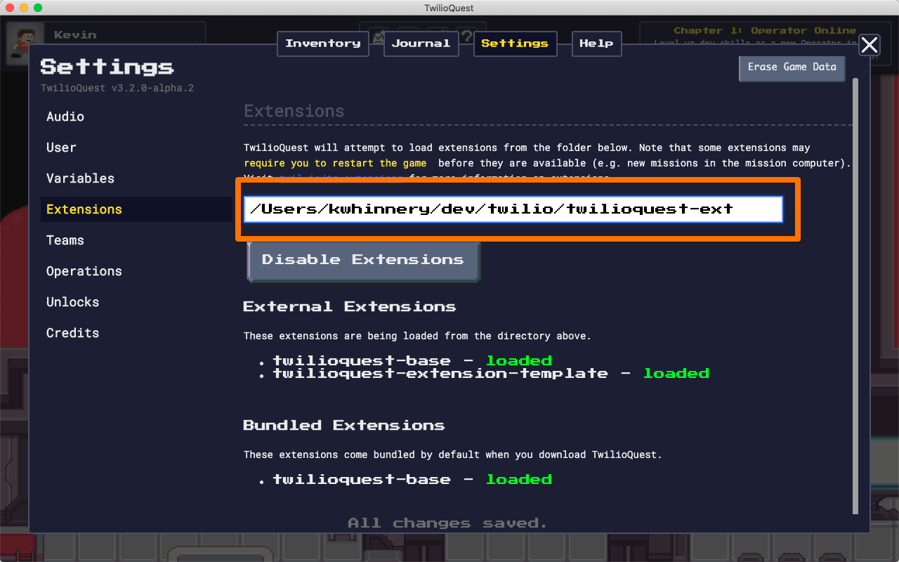
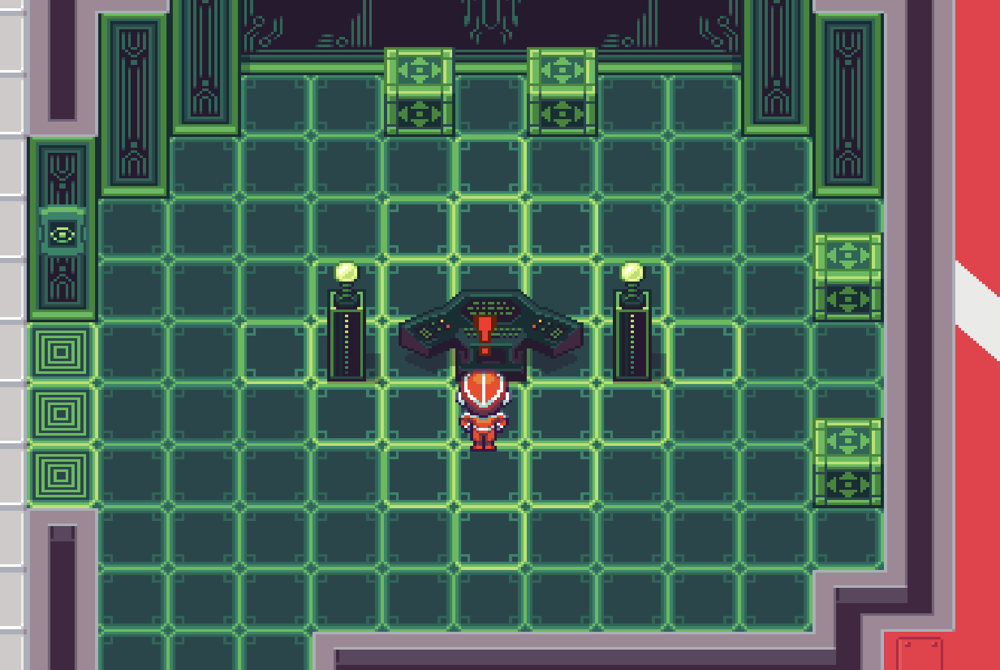

# Getting Started
**TwilioQuest Extensions** allow you to build educational RPG adventures for players to enjoy in [TwilioQuest](https://www.twilio.com/quest). You can create [new levels](levels), new [code challenges](objectives) for players to overcome, and [new characters](npcs) for players to meet on their journey. You can also [override and extend](architecture) existing content with your own embellishments.

We can't wait to see what you build in TwilioQuest!

## Enabling extensions in the game

Extensions are available in the upcoming 3.2 release of TwilioQuest, which we plan on launching in October at [SIGNAL 2021](https://signal.twilio.com). Before October 2021, you may need to select the "3.2 Preview" branch in the launcher after [downloading and installing the game](https://www.twilio.com/quest/download).


After launching the game, go to the `Settings` menu and enable extensions.


Once you have enabled extensions, specify a folder on your computer where you will download and manage extensions. This should be the full path to an empty folder on your computer (you should create such a folder first, if you haven't already). This folder will contain multiple subfolders - one for each extension you download/develop/install.



::: tip
After enabling extensions for the first time, or after adding a new level, we recommend restarting the game to ensure all extension content is loaded. This shouldn't be necessary most of the time during content authoring, but some data (like available levels) is currently only loaded once at start-up.
:::

Once extensions are enabled and you've selected a folder to contain all of your extensions, you're ready to create a new extension yourself!

## Creating your first extension

An **extension** is a subfolder of the extensions folder you created earlier that contains an [npm package (Node.js code and resources)](https://docs.npmjs.com/packages-and-modules/introduction-to-packages-and-modules). The extensions folder may contain one or many such packages, each with its own new content or features.

```
your-extensions-folder/
├─ my-extension/
│  ├─ levels/
|  ├─ objects/
|  ├─ ... other stuff ...
│  └─ package.json
└─ your-extension/
   ├─ levels/
   ├─ objects/
   ├─ ... other stuff ...
   └─ package.json
```

Creating a new extension requires creating a new subfolder under your extensions folder that contains at least a `package.json` file. You *could* create your extension folder from scratch, but we don't recommend that you do so. We have created a [template repository on GitHub](https://github.com/TwilioQuest/twilioquest-extension-template) that we suggest you use as a starting point.

To create your own copy of this starter code to host on GitHub (recommended!), click the green "Use this template" button.


Follow the prompts to create your own project [based on our template repo](https://github.com/TwilioQuest/twilioquest-extension-template/generate).

## Working on your extension locally
When you've created your own copy of this template repo, [clone your new repository](https://docs.github.com/en/github/creating-cloning-and-archiving-repositories/cloning-a-repository) into the extensions folder you specified in the game client when you enabled extensions.

```bash
cd /path/to/extensions/folder
git clone https://github.com/yourusername/your-repo-name.git
cd your-repo-name
```

Creating a TwilioQuest extension will require that you have [Node.js and npm](https://nodejs.org/en/download/) installed. Once you have installed Node.js, you can install the template extension's dependencies with:

```bash
npm install
```

After cloning your extension in the extensions folder, you should be able to see it in the `Extensions` submenu under `Settings` in the game client.


The template extension has a simple VR training level created for you to reference and start hacking on. Interact with the VR Training computer aboard the Fog Owl to load up this sample mission!



## Getting help & reporting bugs
To ask the developer community for help, you can post a question in our [community forums](https://community.twilio.com/twilioquest) or join the `#extension-dev` channel on our [Discord server](https://twil.io/tq-discord). While there is no formal support channel for extension development, you may find other like-minded community members ready to help with the problem you've encountered.

If you feel you have found a bug in the authoring tools, the channels above are also the right place to report it. Please try and include as much detail about the problem as you can before posting, including:

* What task are you trying to accomplish?
* What have you tried in order to accomplish this task?
* What happens when you try to accomplish the task?
* What did you expect to happen, but did not happen?

Answering these questions in advance when you ask for help will maximize the chances that someone from the community can effectively assist you.

Thanks for being part of the TwilioQuest developer community!
