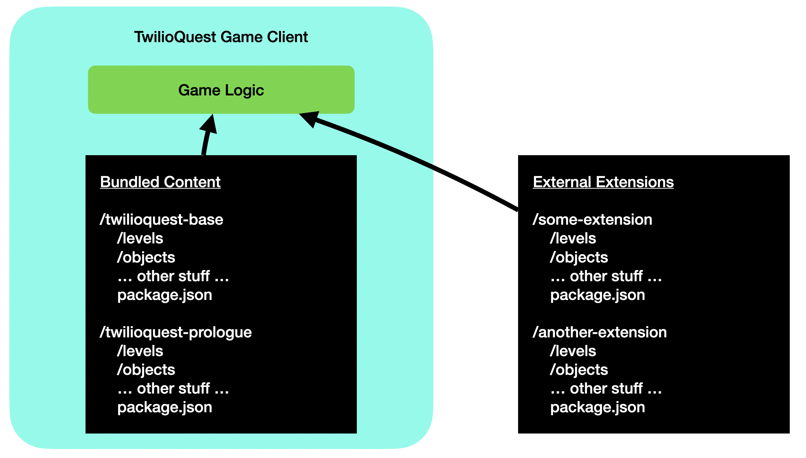
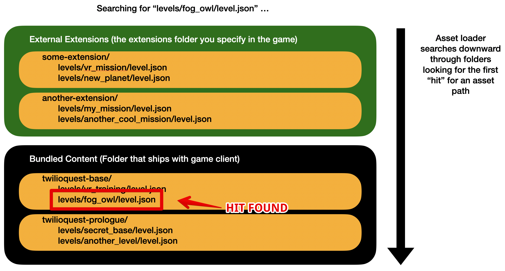
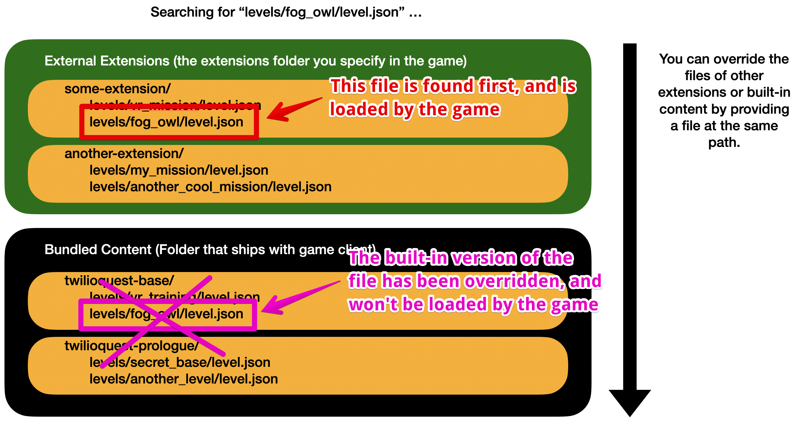

# Architecture Overview
In this guide, we'll explain a bit about the architecture and layout of TwilioQuest and the Extension system. We recommend reading this section before going too much farther, to get a sense of how the Extension system is supposed to work.

## How TwilioQuest Extensions work
TwilioQuest is an [Electron desktop application](https://www.electronjs.org/) - Electron allows developers to use HTML, CSS, and JavaScript to build applications that run like a native desktop app. Apps you use every day, like Slack, Discord, and Visual Studio Code use Electron under the hood.

The TwilioQuest game client reads in many game assets at runtime from the filesystem - like event scripts, written tutorial content, and level maps. Before version 3.2 of TwilioQuest, this content could only be read from inside the compressed and signed game bundle that gets downloaded to your computer. Enabling extensions allows TwilioQuest to look for those assets in another folder in your computer as well. This is what allows you to create new levels, objectives, and other content inside your extension project.



The structure of the external extensions folder, and the extensions within, is the same structure as the folder of game assets that ship along with the game. When extensions are enabled, you are merely telling TwilioQuest "hey - you can look for game assets in this other folder, too, not just the one in the game bundle".

## Extension folder structure
All content for the game, whether it is packaged and shipped with the game by default or loaded as an extension, is an [npm package](https://docs.npmjs.com/packages-and-modules/introduction-to-packages-and-modules). An extension folder will have a structure similar to this. 

```
my_extension/
├── levels/
│   └── my_new_level/
│       ├── conversations/
│       │   ├── bob.pug
│       │   └── alice.pug
│       ├── maps/
│       │   ├── default.json
│       │   └── another_map.json
│       ├── objectives/
│       │   └── example_objective/
│       │       ├── objective.json
│       │       ├── description.md
│       │       ├── walkthrough.md
│       │       └── validator.js
│       ├── events.js
│       └── level.json
├── objects/
│   └── my_custom_object/
│       ├── config.js
│       └── my_custom_object_spritesheet.png
├── tilesets/
│   └── MyCustomObjects.json
└── package.json
```

#### levels/
The `levels` folder is where you will define new explorable areas for TwilioQuest. Each level folder will contain:

* [Maps](maps), editable with the [Tiled map editor](https://www.mapeditor.org/)
* [NPC conversations](npcs) with dynamic dialogue options
* [Objectives](objectives), which are the means by which you will present code challenges to players
* [An events.js file](events) which you can use to script the game world based on level lifecycle events
* [A level.json configuration file](../api/levels) that contains information about the level you are adding to the game

#### objects/
The `objects` folder contains [custom objects](objects) you may want to add to the game.

#### tilesets/
The `tilesets` folder is where you can store your own custom [Tiled map editor](https://www.mapeditor.org/) tileset files. If you used the [extension template](https://github.com/TwilioQuest/twilioquest-extension-template), it is already pre-configured with the tilesets we use to build TwilioQuest, so you may not need to work directly with this folder very often.

#### package.json
The `package.json` file at the root of this directory is where you will configure your extension [as a Node.js package](https://docs.npmjs.com/cli/v7/configuring-npm/package-json). If you need to install third-party Node.js libraries, you will do so here. In the future, we also plan to make use of the `engines` configuration property so you can specify which versions of TwilioQuest your extension supports.

## Resolving the path to game assets
When TwilioQuest wants to load a game asset - whether it's a map file for a level or the configuration for an in-game object of some kind - it will use an asset loader that looks for files in either the built-in game bundle, or the extensions folder if extensions have been enabled.

If the player wants to go to a [level](levels) whose configuration can be found at the path `levels/fog_owl/level.json` (this is the file path for the main *Fog Owl* level that acts as the hub for most of the game), it will attempt to "look up" that file by iterating through every content folder (starting with extension folders) and return the first "hit".



If all extensions provide new content at different file paths, then TwilioQuest will always load the one and only version of an asset that exists. However, it is possible for extensions to override other extensions as well. The asset loader will return the first "hit" that it finds. Let's say that the author of `some-extension` wanted to override the level configuration for the Fog Owl. They could create a file in their extension at the path `levels/fog_owl/level.json`, and the game would load that version of the file instead.


