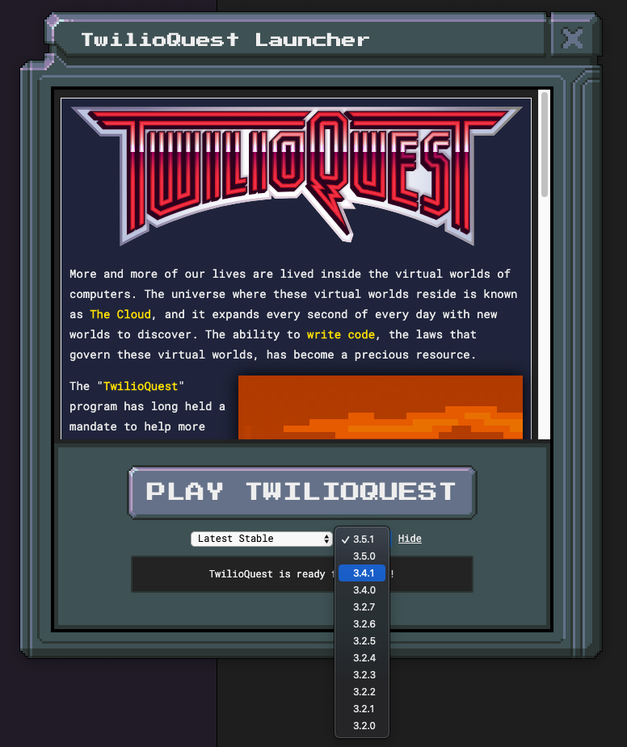

# How to Use a Different Version of TwilioQuest

Sometimes it can be useful to load up an older version of TwilioQuest. Perhaps the latest version is not working. Perhaps there is old content you want to revisit.

Start by opening up the TwilioQuest launcher. You'll want to click on the `More >` link shown in the picture below.

After clicking this option, you'll get the choice to change TwilioQuest versions and release channels.

This next image shows the drop down of all the old versions you could choose to load. Click any of them, and the TwilioQuest Launcher will start downloading and setting up the selected version.

The release channel drop down on the left has other versions of the game you can check out. This includes older major releases, translated verions, and preview versions!

