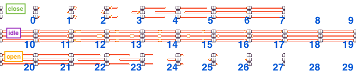
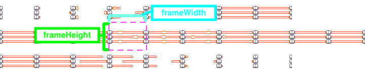

# Creating Custom Objects

Sometimes you want to do more than just paint a scene with tiles. You want to open a chest or talk to an NPC. Objects are how you create dynamism in the TwilioQuest world.

::: warning WIP ⚠️

This guide is still a work in progress!

:::

## What is an Object?

Objects in TwilioQuest are _things_ that create dyanmic behavior. This could be something like an NPC or a door that opens when you approach it.

An object is composed of a few different configuration files.

- A configuration file called `config.js`
- Any image files needed to render the object
- An icon image for use in Tiled tilesets

## Built-in Objects

TwilioQuest comes with built in objects that handle some of the common use cases you might have for dynamic objects. Check out the [built in objects API page](/api/objects.html) for a list of these before re-building something that already exists!

## Making a custom object in TwilioQuest

Objects in TwilioQuest have a core `config.js` files that exports a module with information TwilioQuest uses to create the object in game. That basic structure with an empty config looks like this:

```js
module.exports = {
  spriteSheets: {},
  animations: {},
  properties: {},
};
```

We're going to go through and add various pieces of configuration to this export to create a laser barrier.

### Start with the visual

The first thing to consider about a new object is how it appears. What does it look like rendered in the game? Our laser barrier will look like this:


We'd also like our object to be animated in a few ways, so we won't be able to _just_ use that image though. In order to describe these animations we'll want to use something a bit more powerful than a single image called a "spritesheet".

### What is a spritesheet?

A spritesheet is a series of frames with an image on them. Usually, this series depicts one of more animations that it's subject is performing. Our laser barrier will have three animations: `close`, `idle`, and `open`.

Here's the spritesheet we're going to use. Each animation is labeled and on a different row and each frame is numbered.



### Importing a spritesheet

We need to add a little bit of information to our `config.js` export to get this spritsheet loaded into TwilioQuest.

First, we'll need to add a new unique key to the `spritesheets` property of our root object. This key needs to be unique across all imported spritesheets in all extensions, so it's a good idea to use a verbose name here (it still needs to be a valid JavaScript key!). We'll use this key: `twilioquest_laserBarrierHorizontal`.

```js
module.exports = {
  spriteSheets: {
    twilioquest_base_laserBarrierHorizontal: {},
  },
};
```

Next, we need to add the name of our spritesheet file. Ours is called `twilioquest_laser_horizontal.png`. This file should be stored right next to our `config.js` file.

```js
module.exports = {
  spriteSheets: {
    twilioquest_base_laserBarrierHorizontal: {
      fileName: "twilioquest_laser_horizontal.png",
    },
  },
};
```

Finally, we need to calculate the frame dimensions for our spritesheet. We're looking for a "frame height" and "frame width" in particular.



For our spritesheet, the frame's width is 72 pixels and the height is 48 pixels. Since the base tile size in TwilioQuest is 24x24 pixels, this means our laser barrier object will take up a 3x2 tile space on the map.

::: tip
Be sure to count the whitespace surrounding each of the frames! It can be hard to calculate this by eyeballing from a single frame. A useful trick is to take the width or height of the spritesheet image and divide it by the number of rows or columns in the sheet.
:::

Here is our final set of modifications to `config.js` to import the laser barrier spritesheet.

```js
{
  spriteSheets: {
    laserSpriteSheet: {
      fileName: 'twilioquest_laser_horizontal.png',
      frameDimensions: {
        width: 72,
        height: 48,
      },
    },
  }
}
```

## Placing an object in the world

We have the minimal set of information needed to render a custom object in TwilioQuest. It doesn't do anything fancy yet, but let's get it showing up!

### Icon for Tiled

Tiled does not understand how to use spritesheets for its icons. Instead, you'll want to take a single frame of your sheet and make it its own file called `icon.png`.


::: warning WIP: Instructions for creating a Tiled Object Sheet

Tiled allows you to create and modify your own tilesets. We use a "collection of images" tileset to manage objects in TwilioQuest. These are [the official Tiled docs on editing Tilesets](https://doc.mapeditor.org/en/stable/manual/editing-tilesets/).

:::

### Placing our laser barrier in Tiled

Check out the [map editing guide](/guide/maps.html) for more information about how to place objects in Tiled.

## Animating an object

Now that we have an object in TwilioQuest, let's animate it!

### Loading animations

First, we'll need to add some new information to the `animations` key of our exported `config.js` object. Each key of this animation object corresponds to an animation this object can use. These keys only need to be unique in the context of this object. No need for global identifiers!

We have three animations we want to create for our laser barrier: `close`, `idle`, and `open`.


Let's create an empty key for each of these animations.

```js
module.exports = {
  animations: {
    close: {},
    idle: {},
    open: {},
  },
};
```

An animation requires two pieces of information to describe it. We need an array listing all the frames in order that this animation will play called `frames`. We also need a `frameRate` variable to control how many frames per second TwilioQuest will play this animation with. Usually, the frameRate should be equal to the length of the frames array.

```js
module.exports = {
  animations: {
    close: {
      frames: [0, 1, 2, 3, 4, 5, 6, 7],
      frameRate: 8,
    },
    idle: {
      frames: [10, 11, 12, 13, 14, 15, 16, 17, 18, 19],
      frameRate: 10,
    },
    open: {
      frames: [20, 21, 22, 23, 24, 25, 26, 27],
      frameRate: 8,
    },
  },
};
```

### Playing an animation

This will be our first implementation of custom scripted behavior! Objects have no animation by default, so we're going to start playing an animation when the map it's in gets loaded.

TwilioQuest objects can have an `events` property at the root of their exported `config.js` object. This property contains an object that can have many different event listeners. Read more about the [events property](/api/custom_objects.html#object-configuration-file) API.

We're going to use the `onMapDidLoad` property for our use case.

```js
module.exports = {
  events: {
    onMapDidLoad: (self) => {
      console.log("I'm in a map that loaded!");
    },
  },
};
```

In the above code sample, we're only logging a statement to the console. But, we're also given access to an instance of our game object called `self`. The [self object](/api/custom_objects.html#object-configuration-file) has many documented APIs. We're interested in the `playAnimation` function in particular.

```js
module.exports = {
  events: {
    onMapDidLoad: (self) => {
      self.playAnimation("idle");
    },
  },
};
```

Once we add this event handler in, we should see our laser barrier playing its idling animation inside of TwilioQuest.

## Changing an object's animation in response to events

Playing our laser barrier animation is a great start, but we also want our barrier to open up after its objective is completed! We're going to listen to a new event called `objectiveCompleted` to accomplish this.

```js
module.exports = {
  events: {
    onObjectiveCompleted: (self, event) => {
      console.log(event);
    },
  },
};
```

This will be the first event we use where we actually want to inspect the event payload. The [objectiveCompleted](/api/events.html#objectivecompleted) event has an `objective` property we can check to see if the appropriate objective was passed.

```js
module.exports = {
  events: {
    onObjectiveCompleted: (self, event) => {
      if (event.objective === "our_custom_objective") {
        self.playAnimation("open");
      }
    },
  },
};
```

Now, when we load into TwilioQuest and hack an objective we should see it slide open! We still cannot pass through this opened barrier though, we need to do one more thing to make that work.

```js
module.exports = {
  events: {
    onObjectiveCompleted: (self, event) => {
      if (event.objective === "our_custom_objective") {
        self.playAnimation("open");

        self.sprite.body.enable = false;
      }
    },
  },
};
```

This is a little bit of a hack, as there is no official API function for what we need yet. But here we reference the internal Phaser sprite representing our object and set its physics body to be disabled. This means our player can no longer collide with it and may pass right through.

We have a problem now though, when you close and re-open TwilioQuest the barrier is back in its idle locked animation!

## Persisting object state across sessions

We're going to take advantage of objects' `state` and `render` properties to reference persisted data across loads.

### Creating initial state

The `state` property of a `config.js` file should have the default values you want this object to start with.

```js
module.exports = {
  state: {
    // closed, opening, open
    animation: "closed",
  },
};
```

Our laser barrier will have an `animation` property that we'll start with the string `"closed"` and will change it to `"opening"` and `"open"` later on.

### Modifying state in response to events

Now that we have a starting state, we want to change it dynamically in response to events that happen while playing. We're going to use the `onMapDidLoad` and `onObjectiveCompleted` events again. Instead of immediately playing animations, we'll use [self.setState](/api/custom_objects.html#object-configuration-file) instead.

```js
module.exports = {
  events: {
    onMapDidLoad: (self, event, world) => {
      if (world.isObjectiveCompleted("our_custom_objecitve")) {
        self.setState({
          animation: "open",
        });
      }
    },
    onObjectiveCompleted: (self, event) => {
      if (event.objective === "our_custom_objective") {
        self.setState({
          animation: "opening",
        });
      }
    },
  },
};
```

### Render our object based on current state

TwilioQuest will call our object's `render` function after an object's state changes. Here is where we want to play appropriate animations or set appropriate frames.

```js
module.exports = {
  render: (self, world) => {
    switch (self.state.animation) {
      case "closed":
        self.playAnimation("idle");
        break;
      case "opening":
        self.playAnimation("open").then(() => {
          self.setState({
            animation: "open",
          });
        });
        break;
      case "open":
        self.sprite.frame = 0;
        break;
    }
  },
};
```

## Pull object properties from Tiled

We have hardcoded our objective name as `"our_custom_objective"`. Let's make one last change to our custom laser barrier object so that it can pull the `objectiveName` property in from Tiled.

```js
module.exports = {
  state: {
    // closed, opening, open
    animation: "closed",
  },
  events: {
    onMapDidLoad: (self, event, world) => {
      if (world.isObjectiveCompleted(self.objectiveName)) {
        self.setState({
          animation: "open",
        });
      }
    },
    onObjectiveCompleted: (self, event) => {
      if (event.objective === self.objectiveName) {
        self.setState({
          animation: "opening",
        });
      }
    },
  },
  render: (self, world) => {
    switch (self.state.animation) {
      case "closed":
        self.playAnimation("idle");
        break;
      case "opening":
        self.playAnimation("open").then(() => {
          self.setState({
            animation: "open",
          });
        });
        break;
      case "open":
        self.sprite.frame = 0;
        break;
    }
  },
};
```

Now we can set the property `objectiveName` on any of our laser barriers to change which objective it will open for.

### Some other boilerplate required properties

The `properties` section of the custom object config contains some other information about how TwilioQuest should build your object.

We need to tell TwilioQuest to use the spritesheet we created further above, and we'll use the first frame in the spritesheet as our default one.

```js
module.exports = {
  properties: {
    sprite: {
      spriteSheet: "twilioquest_base_laserBarrierHorizontal",
      defaultFrameIndex: 0,
      // We'll not use this feature, so we should turn it off
      useGidAsDefaultFrameIndex: false,
      // We don't need any layered sprites for the laser barrier
      layers: [],
    },
  },
};
```

## Our final custom object config

This is our final laser barrier object config after we put together all the property chunks we built in this guide.

`objects/laser_barrier/icon.png`


`objects/laser_barrier/twilioquest_laser_horizontal.png`


`objects/laser_barrier/config.js`

```js
module.exports = {
  state: {
    // closed, opening, open
    animation: "closed",
  },
  events: {
    onMapDidLoad: (self, event, world) => {
      if (world.isObjectiveCompleted(self.objectiveName)) {
        self.setState({
          animation: "open",
        });
      }
    },
    onObjectiveCompleted: (self, event) => {
      if (event.objective === self.objectiveName) {
        self.setState({
          animation: "opening",
        });
      }
    },
  },
  render: (self, world) => {
    switch (self.state.animation) {
      case "closed":
        self.playAnimation("idle");
        break;
      case "opening":
        self.playAnimation("open").then(() => {
          self.setState({
            animation: "open",
          });
        });
        break;
      case "open":
        self.sprite.frame = 0;
        break;
    }
  },
  properties: {
    sprite: {
      spriteSheet: "twilioquest_base_laserBarrierHorizontal",
      defaultFrameIndex: 0,
      // We'll not use this feature, so we should turn it off
      useGidAsDefaultFrameIndex: false,
      // We don't need any layered sprites for the laser barrier
      layers: [],
    },
  },
  animations: {
    close: {
      frames: [0, 1, 2, 3, 4, 5, 6, 7],
      frameRate: 8,
    },
    idle: {
      frames: [10, 11, 12, 13, 14, 15, 16, 17, 18, 19],
      frameRate: 10,
    },
    open: {
      frames: [20, 21, 22, 23, 24, 25, 26, 27],
      frameRate: 8,
    },
  },
};
```
