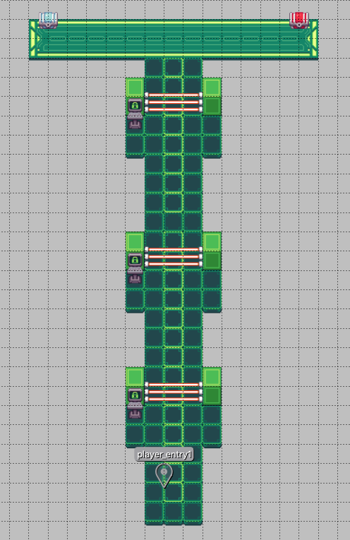

# Creating New Levels

::: warning  ⚠️ UNDER CONSTRUCTION

This guide is still a work in progress!

:::

A **level** in TwilioQuest is an explorable area in the game that can contain objectives, game objects, and characters for the player to interact with. There are two types of levels that you can create:

* A **VR training mission** accessible through the Fog Owl's training simulator room
* A **location within The Cloud** that the player can navigate to using the Fog Owl's navigation map interface (**NOTE:** This feature is under construction - the navigation map should be available in summer 2021.)

A level folder contains a configuration file (a file called `level.json`, which we will cover later on) and the following assets:

* **Maps:** These files specify the visual layout and game objects present within the level. A level may have multiple maps.
* **Objectives:** Objectives are where you will deliver most of the educational content for your level. You will describe your objective using [Markdown](https://github.github.com/gfm/) and write validation code for your objective using [Node.js](https://www.nodejs.org).
* **Conversations:** You can write dynamic non-player character (NPC) dialogue for the characters the player will encounter in the level.
* **Event Scripting:** A level folder contains an `events.js` file which can respond to level lifecycle events, and add dynamic behavior to your level.

Read on to learn more about how these pieces fit together, and how to get started creating your own level.

## Planning your level
Which kind of level you choose to build comes down to the type of content you are looking to create for players.

| Story Levels | VR Training Levels |
| ------------ | ------------------ |
| Are you looking to create a **story-driven experience** with characters, event scripting, and an immersive environment? You should create a level that appears as a **location within The Cloud** on the navigation map interface. |  Are you more interested in creating **task-focused exercises** that don't require extensive story elements? You should create a mission that uses the **VR Training** tiles and motif, and just focus on creating chests and laser barriers. |

We recommend that most content authors start by creating a VR Training mission, since creating event scripts, NPC conversations, and maps with detailed visuals can be quite time consuming when you are just getting started. To see how you can make your level show up in either the navigation interface or VR training computer, read the configuration section at the bottom of this guide.

### Planning your content and learning objectives
Before you start hacking on a level, we recommend you begin in a document and come up with a list of [learning objectives](https://www.bobpikegroup.com/trainer-blog/5-steps-to-writing-clear-and-measurable-learning-objectives). What should your learners have practiced and mastered by the time they complete the level? After writing out your learning objectives, you should take some time to think through how you could assess whether or not the learner has actually mastered those concepts. Finally, you should try and identify any prerequisites or ordering - e.g. if you want to teach the Python REPL, your learner should have Python installed first.

:::tip
You can make other levels a **prerequisite** before a given level can be loaded in the VR training mission computer. Refer to the level configuration guide below to see how this works.
:::

Creating a learning objective outline, considering how you will assess learning objective outcomes, and identifying dependencies will help you visualize how your level should play out. In general, a learning objective maps to a single `objective` within the game (an instance of a "hackable" object or barrier in the map). A single map should contain **six objectives or fewer**, and be doable by your target audience in **under 30 minutes**. These are not hard and fast rules, but hopefully useful heuristics as you plan out your content.

If you have more learning objectives than can fit into a single map, consider breaking up your content to span multiple maps.

### Example learning objective outline
Here is an example of an objective outline for a TwilioQuest VR Training mission focused on teaching [how to send an SMS message using the Twilio API](https://www.twilio.com/docs/sms/send-messages). This will be very specific to how the Twilio API works, but this format/methodology can be adapted to teach any kind of technical concept.

#### Objectives
1. The learner should be able to find their account SID and auth token in the Twilio console, to use for API requests.
1. The learner should be able to make an authenticated REST API request to Twilio using their account credentials. (Requires #1)
1. The learner should understand how to use the `/Messages` REST API endpoint to create a new SMS text message. (Requires #2)
1. The learner should be able to send a media message (in the US or Canada) by providing the `mediaUrl` parameter in a request to the `/Messages` endpoint. (Requires #3)
1. The learner should be able to specify a status callback URL when they send a messages using the `/Messages` endpoint. (Requires #3)

#### Validation
1. Ask the user to input their account credentials, and we can make an API request on their behalf to ensure that they are correct. We should store the credentials in a local file to use for subsequent validation requests.
1. Ask the user to make an authenticated API request to the `/Accounts` endpoint, which requires no parameters. Ask them what one of the data elements is in the response sent back from the server. Using their configured account credentials, ensure the input they gave us was correct.
1. Ask the user to send an outbound SMS message using their account credentials, with the string of text "TwilioQuest rules". Ask the user to input a "SID", or unique ID, for the message. Using that SID, check the Twilio API to see if the message has been sent, and if it contained the appropriate message text.
1. Ask the user to send a media message with the API, and provide a SID for validation. Check the Twilio API to see if a media message has been sent.
1. Provide a URL to a server I (as the content developer) control to use as a status callback URL. Ask the user to send a message using this status callback URL. Check the server to ensure that the status callback message was received.

#### Sketching the level layout
Once you have a sense of what your learning objectives are, and how you will assess completion of those objectives, you can start to plan out where you will place objectives within a map to support the learning path you have laid out.

In the example above, objectives 1, 2, and 3 each build on the previous one, and should be completed in order. Objectives 4 and 5 both require #3, but could theoretically be completed in any order.

One way you might lay out a level to contain these objectives would be a linear path to complete the first three objectives, followed by a branching course to potentially complete the final two.



## Creating a new level folder

At the time of this writing, the best way to create a new level is to **copy the level folder** of an existing level. This will copy all the map and tileset configuration you will need to effectively create a new level. The example level folder [in the template repo](https://github.com/TwilioQuest/twilioquest-extension-template/tree/main/levels/vr_mission_template) is a good one to use. It contains all the necessary files you will need to create a level. After doing this, your new level folder should look something like this:

```
my_extension/
└── levels/
    ├── the_level_you_copied/
    └── your_new_level_folder/
        ├── maps/
        │   ├── default.json
        ├── objectives/
        │   └── example_objective/
        │       ├── objective.json
        │       ├── description.md
        │       ├── walkthrough.md
        │       └── validator.js
        ├── events.js
        └── level.json
```

## Configuring and building your level

After creating your new level folder, open the `level.json` file at the root of the new level folder. This configuration file contains the metadata for your new level. A full reference for this file [can be found here](../api/levels), but here are a few properties you should make sure to change:

* `title`: The human-readable name for your level - it will show up as the title text for either the navigation interface or VR mission computer.
* `description`: The player will see this detail text if they select your level in either the nav interface or VR mission computer.
* `is_mission`: This boolean flag indicates whether or not your level will be displayed in the VR mission computer.

