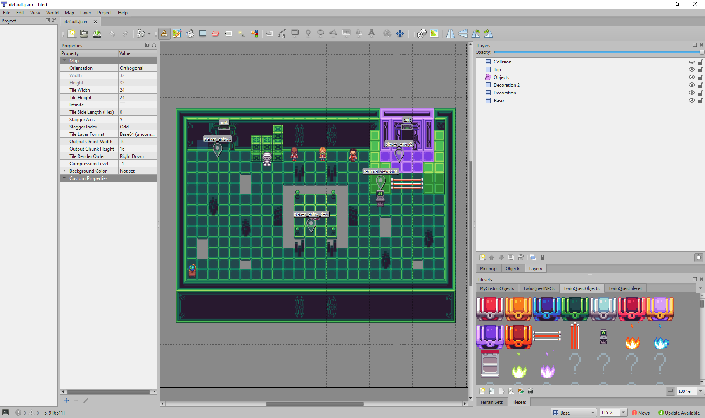
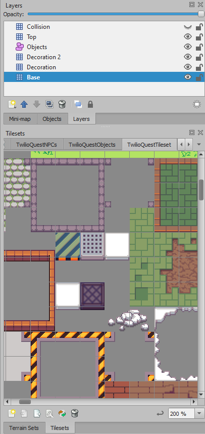
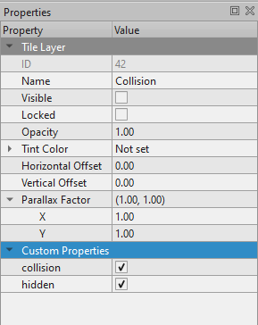
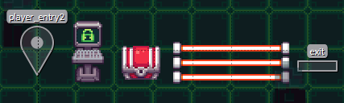

# Editing Maps

::: warning WIP ⚠️

This guide is still a work in progress!

:::

## How to use Tiled

[Tiled](https://www.mapeditor.org/) is a complicated piece of open source software! It does a lot of powerful things, but there are a few main features you'll need to make use of authoring your first TwilioQuest mission.

This video introduces the basics of editing tiles, objects, and layers in an older version of Tiled. Most of these features have been core to Tiled for a long time and should be similar to the latest version.

<iframe width="560" height="315" src="https://www.youtube.com/embed/ZwaomOYGuYo" title="YouTube video player" frameborder="0" allow="accelerometer; autoplay; clipboard-write; encrypted-media; gyroscope; picture-in-picture" allowfullscreen></iframe>

This video is part of [a multi-part series](https://gamefromscratch.com/tiled-map-editor-tutorial-series/) that you can follow to learn more about advanced Tiled features.

Tiled also has a comprehensive set of [documentation](https://doc.mapeditor.org/en/stable/manual/introduction/), an active [Discord](https://discord.com/invite/39wbTv7), and [forum](https://discourse.mapeditor.org/) community you can reach out to with questions.

::: tip

If you're looking to create a new map, we recommend that you copy the provided one in the [twilioquest-extension-template](https://github.com/TwilioQuest/twilioquest-extension-template) rather than make a new one from Tiled. This will keep all your layers and tilesets configured.

:::

## Layers and Tiles
Tiles are the core of how you'll build the static parts of a TwilioQuest map. In Tiled, these are placed within "tile layers", seen on the top right of the Tiled editor. These layers function similarly to layers in painting programs like Adobe Photoshop: tiles placed on the higher layers show up on top the tiles on the lower layers. You can select a layer, then click on a square on the map to place a tile, similar to drawing in similar painting programs.

::: tip

Read more on how to use Tiled in the official docs on [working with layers](https://doc.mapeditor.org/en/stable/manual/layers/) and [editing tile layers](https://doc.mapeditor.org/en/stable/manual/editing-tile-layers/).

:::

#### Placing Tiles
Tiles are pictures that you can place in your map. Think of placing tiles like placing puzzle pieces onto a grid. The tiles that you place onto the grid will show up in your custom maps in TwilioQuest!

To place a tile, follow these steps:

1. In the Layers window on the top right of the Tiled editor, select a non-object layer (any layer with a grid icon). 
2. Below, in the Tilesets window, select the "TwilioQuestTilesets" tab.
3. Click on a tile in the resulting window below the tab. 
4. On the toolbar above the grid, select the Stamp Brush (stamp-looking button).
5. On the grid, in the middle of the editor, click on a square.

Ta-da! You've placed a tile in your level! Click on more squares to place more tiles.

You might notice that some tiles will show up when you click on specific layers, and some tiles won't show up when you click on other layers. This is due to the way tile layers work, which is described in the next section.

#### Default Template Layers and Characteristics.
Tile layers handle how the tiles are displayed in TwilioQuest. The [TwilioQuest extension template](https://github.com/TwilioQuest/twilioquest-extension-template) provides Tiled maps in .json format. They come with six tile layers: 
- **Collision**: Use this layer to place collision tiles. The player cannot walk through tiles placed on this layer.
- **Top**: Use this layer to provide depth to your decorations on the Decoration 2 / Decoration layers. The player will walk behind the tiles placed on this layer. Great for placing walls with depth. 
- **Objects**: The player, NPCs, and other interactable objects appear on this layer.
- **Decoration 2 / Decoration**: Use these layers to decorate your map on top of the floor. The player will walk in front of the tiles placed on this layer. 
- **Base**: Use this layer to create a floor for your map.

Similar to other digital painting applications, the tiles placed in the higher layers will appear on top of the tiles in the lower layers. Use this knowledge to create custom maps with depth!

If you need more layers, follow these steps:
1. Right click in the white space in the Layers window on the top right of the editor.
2. Click "New", then "Tile Layer".
3. Type in the name of your new layer.
4. Drag the layer up and down to reorganize the layer such that the tiles in your new layer will appear above or below tiles in other layers.

#### Layer Properties
Layers can have a few special properties that TwilioQuest will consume to treat them differently:

- `collision (boolean)` - If this is set to true, then the tiles in this layer will prevent the player from passing through them. There is usually a main `Collision` tile layer with this property.

- `hidden (boolean)` - When set to true, this tile layer will not be rendered visually to the player. The `Collision` layer should have this property set as well.

- `useCollisionMasks (boolean)` - This is a more advanced feature that will let the tiles in a tile layer use the Tiled Collision Editor to specify a custom collision box. This can be useful if tiles do not visually sit on the tile grid.

It is imperative to have a **collision layer** in your map with the `collision` and `hidden` properties set to `true`.

To view the properties of a layer, click on the layer name in the layer window on the top right of the Tiled editor. The layer properties will then show on the left side of the editor.

To change the boolean value of a property, click on the checkbox next to the propery name. 

To add a property to a layer, follow these steps:

1. Right click on "Custom Properties"
2. Select "Add Property"
3. Type in the desired property name in the text box. Select "boolean" in the dropdown menu on the right.
4. Click on the checkbox to set the boolean property to `true`; otherwise, it will be set to `false`.

## Objects and Properties

Objects are important for accomplishing the various dynamic parts of TwilioQuest. This includes things like non player characters, laser barriers, and more!

Objects live within a special type of layer called an "object layer". Generally, each TwilioQuest map has a single object layer where every object lives. This layer is conventionally called **Objects**.

::: tip 

For a more detailed guide, please refer to the Tiled docs on [working with objects](https://doc.mapeditor.org/en/stable/manual/objects/) and [editing properties of objects](https://doc.mapeditor.org/en/stable/manual/custom-properties/).

:::

### Object Types

[Built-in objects](/api/objects.html) and [custom objects](guide/custom_objects.html) can be added to the **Objects** layer. They have properties that can be tweaked for different effects depending on the object.

These are a few important built-in objects that essentially every map will use:

- [Player Entry Point](/api/objects.html#player-entry-points) - controls player spawn point
- [Terminal](/api/objects.html#terminals) - launches an objective for the player to complete
- [Chest](/api/objects.html#chests) - same as terminal, good for optional missions
- [Laser Barrier](/api/objects.html#laser-barriers) - blocks a player's progression until a specific objective is completed
- [Exit](/api/objects.html#exits) - transports a player between maps, you'll at least need one to take your player back to the Fog Owl after they play your mission.

### Placing Built-in Objects

The steps to placing built-in objects are similar to that of placing tiles:

1. In the Tilesets window on the top right of the Tiled editor, select the **TwilioQuestObjects** or **TwilioQuestNPCs** tab.
2. Click on the object you would like to add to your custom map.
3. In the Layers window below, select the **Objects** layer.
4. On the toolbar on the top of the grid, select the Insert Tile button (the picture-frame button).
5. On the grid, click on the location you would like to place your new object.

Once the objects are placed, you can change its properties in the Properties window on the left. You can view the properties by clicking on the built-in object links above this section.

### Placing Entry Points and Exits
The easiest way to place entry points and exists is to copy and paste the existing ones in the template maps, then modifying their properties as described in the next section.

To create a new entry point or exit from scratch, follow these steps:

1. On the toolbar on the top of the grid, select the **Insert Rectangle** button for exits or **Insert Point** for entry points.
2. On the grid below, click on the location you would like to place your new entry point or exit.
3. Edit its properties as described below and documented in the links for the built-in objects list above. 

### Editing Object Placement and Properties 
To edit an object's placement and properties, follow these steps:

1. In the Layers window on the bottom right of the Tiled editor, select the **Objects** layer.
2. On the toolbar on the top of the grid, select the **Select Objects** button (the button with two pink rectangles and one dotted rectangle).
3. Click on the desired object on the grid below.
4. To change its physical appearance:
    - To move the object, click and drag the object to the desired location.
    - To scale the object, click on the desired straight arrows and drag.
    - To rotate the object, click on the object again, then click and drag the curved arrows.
    - Depending on the object, the object may not necessarily be re-scaled or rotated properly in-game.
5. To change its property, observe them in the Properties window on the left and change them accordingly.
    - To add a property, right click on the **Custom Properties** label and select **Add Property**.

