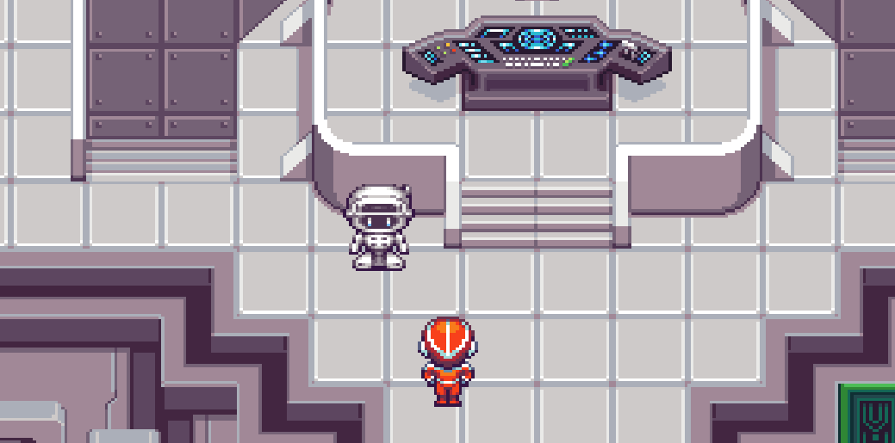

# Non Player Characters

::: warning WIP ⚠️

This guide is still a work in progress!

:::

## What is an NPC?

Non Player Characters (NPCs) are entities that represent other characters besides the player that live in The Cloud. These characters have their own avatars and names to give them unique identities. The primary way that players interact with NPCs is via conversations.



## What is a conversation?

When a player uses their interaction button on an NPC a conversation screen will launch. It looks like the screen below, and has a few different parts. An entire conversation is composed of one or more of these screens in a row.


### Portrait

This is a close up picture of the NPC that is participating in the conversation. This image can be adjusted throughout the conversation to change the character's emotions.

### Statement

The text that the NPC is speaking to the player. This text uses HTML so it can be styled with highlights, italics, or other styles. If a character has voice over files, they'll be narrated to the player alongside this text.

### Display Name

This is the name of the NPC your player is conversing with. This is not tied to a specific conversation file, so it can change when a conversation is launched if needed.

### Reponses

This is a list of options the player receives for how they'd like to respond to the NPC they're talking to. When the player chooses a response, a new conversation screen displays and the conversation continues. Responses can be chosen by clicking or pressing the corresponding number.

### Response

Every individual response is best constructed as a short line of text from the perspective of the player speaking.

### End Conversation Response

At the end of every conversation screen's responses, an `<end conversation>` response option is appended. If this option is chosen then the conversation will be terminated.

## Creating an NPC and conversation

There are two main aspects to creating an NPC that a player interacts with in TwilioQuest, the object itself and its conversation file(s).

### Creating the NPC object

An NPC object is a [built-in TwilioQuest object](/api/objects.html#non-player-characters-npcs) with a special property that corresponds to a conversation name.

An NPC object can be placed into a level of TwilioQuest like any other game object. Check out the [guide on map editing](/guide/maps.html) to learn more.

### Create a conversation file

The conversation file contains all of the information needed to describe the sequences of conversation screens a player will navigate through while talking to an NPC.

The name of this file base name is important. Conventionally, we title these after the name of the NPC that will speak the file. If an NPC has more than one conversation file, we'd called them something like `cedric_welcome` and `cedric_congratulations`.

### Conversation HTML

TwilioQuest conversations are created using [Conversation HTML](/api/conversations.html#conversation-html). Conversation HTML is made of a variety of tags that describe a conversation screen. If you look at the list of [conversation tags](/api/conversations.html#conversation-tags) in the API documentation you'll see they correspond to the sections of [the conversation screen above](/guide/npcs.html#what-is-a-conversation).

### Playing a conversation

There are a couple different ways to launch into a conversation.

#### Link a conversation file in Tiled

Use the `conversation` property of an [NPC object](/api/objects.html#non-player-characters-npcs) in Tiled and set it to the basename of the conversation file you want to play when a player interacts with that NPC.

#### Use the world API to dynamically converse

You can dynamically play conversations using the [startConversation](/api/events.html#startconversation) function on the world API inside of a custom object or events.js file.

## Voice Overs

Voice over files are pulled from the `vo` directory inside of a level's `conversations` directory.

Each statement in a conversation file should have it's own voice over audio file. When a statement is "spoken" by an NPC conversation partner, TwilioQuest will look up the appropriate audio file.

TwilioQuest uses the conversation file name and statement id to look up voice over audio files. The basename of the file and the id of the statement are concatenated with an underscore.

For example:

`levels/cool_level/conversations/cool_npc.pug`

```pug
conversation
  statement#cool_speech
    responses

  statements
    statement#cool_speech
      text.
        I have a cool thing to say!
```

For the statement `id`'d as `cool_speech` given by the `cool_npc` conversation we would find the voice over audio file at the following file path:

`levels/cool_level/conversation/vo/cool_npc_cool_speech.mp3`
