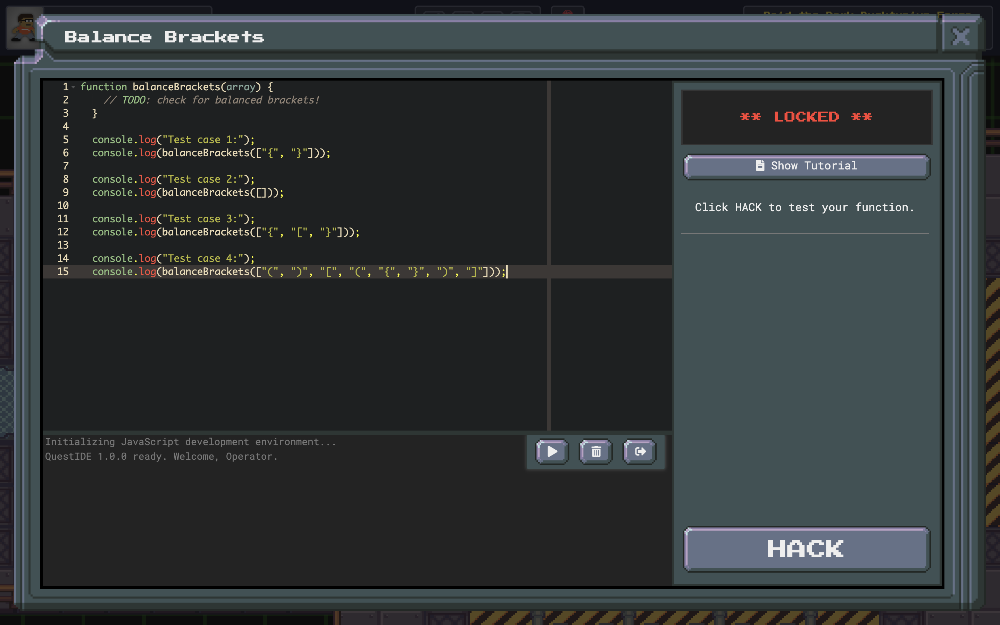

# Creating Objectives

## What are objectives?

Objectives are the challenges players are presented with when opening terminals in TwilioQuest. Their purpose is to teach something new and reward users for successful completion. An `Objectives` folder is used to group all of the objectives for a particular level together.

```
my_extension/
├── levels/
    └── my_new_level/
        └── objectives/
            └── example_objective/
                ├── objective.json
                ├── description.md
                ├── walkthrough.md
                └── validator.js
```

For more information on creating and configuring levels, see the [Creating New Levels](https://twilioquest.github.io/extension-docs/guide/levels.html) guide!


As you can see in the directory tree above, each objective is broken up into several files:
- [description.md](#description-md-file),
- [example.js](#example-js-file),
- [objective.json](#objective-json-file),
- [validator.js](#validator-js-file),
- and [walkthrough.md](#walkthrough-md-file)

It's this combination of files that make up your objective.

## [Description.md](https://github.com/TwilioQuest/twilioquest-base/blob/62e9e22d2195005b6d8fc6e8a69558a3817a60b6/levels/challenge-questions/objectives/balance-brackets/description.md) File

The description file covers the lore, requirements, a brief explanation of what the user needs to do, and some examples for how to complete the objective. Changes you make here will be reflected in the 'Objective' tab of the terminal.

## [Example.js](https://github.com/TwilioQuest/twilioquest-base/blob/62e9e22d2195005b6d8fc6e8a69558a3817a60b6/levels/challenge-questions/objectives/balance-brackets/example.js) File

The example file is what players will see the first time they open up the in-game code editor by clicking the _</> Show Code Editor_ button.

## [Objective.json](https://github.com/TwilioQuest/twilioquest-base/blob/62e9e22d2195005b6d8fc6e8a69558a3817a60b6/levels/challenge-questions/objectives/balance-brackets/objective.json) File

The objective file contains the information for the 'Overview' tab, which includes the fields: title, description, validation_fields, show_ide, and rewards.

For more details, check out the [API Reference](https://twilioquest.github.io/extension-docs/api/objectives.html#objective-configuration)

## [Validator.js](https://github.com/TwilioQuest/twilioquest-base/blob/62e9e22d2195005b6d8fc6e8a69558a3817a60b6/levels/challenge-questions/objectives/balance-brackets/validator.js) File

The validator file exports a function that is responsible for checking whether or not the user has successfully completed your objective after clicking the _HACK_ button.

## [Walkthrough.md](https://github.com/TwilioQuest/twilioquest-base/blob/62e9e22d2195005b6d8fc6e8a69558a3817a60b6/levels/challenge-questions/objectives/balance-brackets/walkthrough.md) File

The walkthrough file is where you'd put step by step instructions on how to complete the objective, as well as link to any external learning resources you feel would be helpful. Changes here can be seen under the 'Help' tab of the terminal.

## Balanced Brackets Example

This objective is found in the 'power generation' area of the _Raid the Ducktypium Forge_ mission.

### Description.md

```md
# Balance Brackets

<div class="aside">
<h3>Requirements</h3>
<ul>
  <li>Create a function called `balanceBrackets`.</li>
  <li>This function receives an array of brackets (brackets being any of the following "[", "]", "(", ")", "{", "}").</li>
  <li>Return true if the brackets are balanced, and false otherwise (the examples explain it best).</li>
  <li>Return true if the input array is empty.</li>
  <li>Once you're done, press <em>HACK</em>.</li>
</ul>
</div>

It looks like this part of the forge is responsible for generating power and distributing it to the rest of the system. This particular terminal ensures the power generator has a balanced fuel mixture.

Create a function `balanceBrackets` that accepts an array of brackets. This function should return a boolean (true/false) based on whether or not the array of brackets is balanced.

<br>

## Examples

- `["{", "}”]` -> `true`
- `[]` -> `true`
- `["{", "[", "}”]` -> `false`
- `["(", ")”, "[", "(", "{", "}”, ")”, "]”]` -> `true`

<br>

Once you've writen this function, click the _HACK_ button!
```


### Example.js

```js
function balanceBrackets(array) {
    // TODO: check for balanced brackets!
  }
  
  console.log("Test case 1:");
  console.log(balanceBrackets(["{", "}"]));
  
  console.log("Test case 2:");
  console.log(balanceBrackets([]));
  
  console.log("Test case 3:");
  console.log(balanceBrackets(["{", "[", "}"]));
  
  console.log("Test case 4:");
  console.log(balanceBrackets(["(", ")", "[", "(", "{", "}", ")", "]"]));
```



### Objective.json

```json
{
    "title": "Balance Brackets",
    "description": "Ensure a combination of brackets is balanced in an array.",
    "validation_fields": [
      {
        "name": "prompt",
        "type": "prompt",
        "placeholder": "",
        "label": "Click HACK to test your function."
      }
    ],
    "show_ide": true,
    "rewards": {
      "xp": 100
    }
  }
  
```


### Validator.js

```js
const assert = require("assert");

const assertTestCase = (testFunction) => (input, expected) => {
  const testResult = testFunction(input);

  assert.strictEqual(
    testResult,
    expected,
    `Expected "${expected}" from input "${input}", but received "${testResult}".`
  );
};

module.exports = async function (helper) {
  let context;

  try {
    context = await helper.pullVarsFromQuestIdeUserCodeLocalScope(
      ["balanceBrackets"],
      "balance-brackets"
    );

    assert(
      context.balanceBrackets,
      "The function balanceBrackets is not defined!"
    );

    const test = assertTestCase(context.balanceBrackets);

    test(["{", "}"], true);
    test([], true);
    test(["{", "[", "}"], false);
    test(["(", ")", "[", "(", "{", "}", ")", "]"], true);
  } catch (err) {
    helper.fail(err);
    return;
  }

  helper.success("You did it!");
};
```

### Walkthrough.md

```md
# Helpful Resources

Here are some links that could help you with hacking this terminal. Be sure to stop by the [TwilioQuest Discord](https://twil.io/tq-discord) if you need further assistance!

## Links

- [Array.push on MDN](https://developer.mozilla.org/en-US/docs/Web/JavaScript/Reference/Global_Objects/Array/push)
- [Array.pop on MDN](https://developer.mozilla.org/en-US/docs/Web/JavaScript/Reference/Global_Objects/Array/pop)
- [If statements on MDN](https://developer.mozilla.org/en-US/docs/Web/JavaScript/Reference/Statements/if...else)
- [Switch statements on MDN](https://developer.mozilla.org/en-US/docs/Web/JavaScript/Reference/Statements/switch)
```


## Validator Examples

This is a validator that uses an asynchronous network request to check if a user entered a valid GitHub username in an objective.

```js
const got = require("got");

module.exports = async (helper) => {
  const username = helper.getNormalizedInput("username", { lowerCase: false });

  if (!username) {
    return helper.fail(`Please enter the username of your GitHub account!`);
  }

  try {
    const response = await got(`https://api.github.com/users/${username}`, {
      throwHttpErrors: false,
    });

    if (response.statusCode === 200) {
      return helper.success(
        `We found your GitHub user, ${username}. Good job!`,
        [{ name: "GITHUB_USERNAME", value: username }]
      );
    } else {
      helper.fail(
        `We couldn't find the GitHub user, ${username}. Is there a typo in the username?`
      );
    }
  } catch (err) {
    helper.fail(
      `Something went wrong when we tried to validate your GitHub username!
      
      ${err}`
    );
  }
};
```

This validator is an example of parsing a user supplied GitHub URL and using it's pieces to dynamically display a user's profile image inside of the Validator response text.

```js
// parsing a URL for a GitHub repository link like so:
// https://github.com/twilioquest/twilioquest-extension-template

module.exports = async function(helper) {
  const { userUrl } = helper.validationFields;

  let parsedUserUrl;

  try {
    parsedUserUrl = new URL(userUrl);
  } catch (err) {
    return helper.fail(`
    "${userUrl}" is not a valid URL.
    `);
  }

  if (!parsedUserUrl.hostname.toLowerCase().includes("github.com")) {
    return helper.fail(`
    "${userUrl}" is not a Github URL.
    `);
  }

  const partsOfPathName = parsedUserUrl.pathname.toLowerCase().split("/");
  // const [, user, repository] = partsOfPathname;
  const user = partsOfPathName[1];
  const repository = partsOfPathName[2];

  if (user !== "twilioquest") {
    return helper.fail(`
    "${userUrl}" is not owned by TwilioQuest!
    `);
  }

  if (!repository) {
    return helper.fail(`
    "${userUrl}" does not contain a repository link!
    `);
  }

  let avatar_url;

  try {
    const response = await fetch(
      `https://api.github.com/users/${user}`
    ).then((response) => response.json());

    avatar_url = response.avatar_url;
  } catch (err) {
    console.log(`Failed to request profile image for "${user}"`);
  }

  return helper.success(`
  We found the repository "${repository}" owned by "${user}"!
  
  `);
};
```

This is an example validator that requests the path to a Python executable from the player, validates that it runs, and then stores it in an environment variable for use in future objectives.

```js
const { spawn } = require("child_process");

module.exports = async (helper) => {
  try {
    const { pythonPath } = helper.validationFields;

    const args = ["--version"];
    const [isExecutableValid, errorMessage] = await helper.isExecutableValid(
      pythonPath,
      args
    );

    if (!isExecutableValid) {
      helper.fail(errorMessage);
      return;
    }

    const pyv = spawn(pythonPath, args);
    let versionString = "";

    pyv.stdout.on("data", (data) => {
      versionString += `${data}`;
    });

    // Python 2 prints version information to stderr.
    // https://stackoverflow.com/questions/26028416/why-does-python-print-version-info-to-stderr
    // We want to capture this in case users mistakenly try
    // to use Python 2.
    pyv.stderr.on("data", (data) => {
      versionString += `${data}`;
    });

    pyv.on("close", (code, signal) => {
      if (code === 0) {
        const [version] = versionString.match(/(\d+\.\d+\.\d+)/);
        const [major, minor, patch] = version.split(".");

        if (major !== "3") {
          helper.fail(`
          It looks like you supplied <span class="highlight">${versionString}</span>. This mission requires <span class="highlight">Python 3</span>.
        `);
          return;
        }

        helper.success(
          `
          Awesome! Looks like you have this version installed: <br/>
          <span class="highlight">${versionString}</span>. You have completed
          the Trial of Installation!
        `,
          [{ name: "PYTHON_EXE", value: pythonPath }]
        );
      } else {
        helper.fail(`
          Welp... something went wrong when we tried to validate this Python
          path. Double check the path and try again.

          Error code: ${code}
          Error signal: ${signal}
        `);
      }
    });
  } catch (e) {
    if (e.name === "NiceError") {
      helper.fail(e.message);
    } else {
      helper.fail(`
        Sorry! We couldn't validate your Python 3 installation. Please try
        again.

        ${e}
      `);
    }
  }
};
```

This is a validator that references the Python executable stored in an environment variable in the previous example validator. The validator reads a user's submitted Python script off of the file system using `jetpack`. It then uses the stored Python executable to test a user's submitted Python script.

```js
const path = require("path");
const jetpack = require("fs-jetpack");
const {
  NiceError,
  executeScript,
  checkSetup,
  executePythonCode,
} = require("../../validation");

// Append this python code to the user-created code - it will execute and
// validate that the user's script did what we expected
const VALIDATION_PYTHON_CODE = `

# Validate variables have been declared
assert 'hail_friend' in locals(), "The 'hail_friend' function was not created."

# Assert hail_friend is a function
assert callable(hail_friend), "hail_friend is not a callable function."

# Call the function so we can inspect stdout
hail_friend()
`;

module.exports = async (helper) => {
  try {
    const py = helper.env.TQ_PYTHON_EXE;
    const programPath = path.join(
      helper.env.TQ_PYTHON_CODE_PATH,
      "functions.py"
    );

    // Ensure prerequisite stuff is set up
    await checkSetup(py, programPath);

    // Our test args
    const ARGS = [];

    // Execute the player's script to ensure it runs
    const stdout = await executeScript(py, programPath, ARGS);
    console.log(stdout);

    // Now, do an assertion check of the code with our own python code appended
    const code = await jetpack.readAsync(programPath);
    const testCode = `${code}\n\n${VALIDATION_PYTHON_CODE}`;

    const testResult = await executePythonCode(helper.env, testCode, ARGS);
    console.log(testResult);
    if (testResult.exitCode !== 0) {
      if (testResult.stderr.indexOf("AssertionError:") > 0) {
        const assertionText = testResult.stderr.split("AssertionError:")[1];
        throw new NiceError(`
          Looks like there's a small problem. ${assertionText}
        `);
      } else {
        throw new NiceError(`
          We couldn't validate your Python code - please try again.
        `);
      }
    } else if (testResult.stdout.toLowerCase().indexOf("hail, friend") < 0) {
      // It should contain the text "hail, friend"
      throw new NiceError(`
        We didn't see the requested string of text output by your
        <span class="highlight">hail_friend</span> function. It needs to print
        the string "Hail, friend!"
      `);
    }

    // If we make it this far, we've passed validation
    helper.success(`
      Well done! Not only did you put the "fun" in "function", you also passed
      the <em>Trial of Reusability</em>.
    `);
  } catch (e) {
    console.log(e);
    if (e.name === "NiceError") {
      helper.fail(e.message);
    } else {
      helper.fail(`
        Sorry! We couldn't successfully run your Python script.
      `);
    }
  }
};
```

Here is an example of an objective markdown file that uses a function inside of it's EJS template to source images relative to an extension.
```
<%
const path = require('path');
const fileUrl = require('file-url');

function getImageUrl(extRelativePath) {
  try {
    const imagePath = path.join(
      context.extensions.directory,
      'twilioquest-extension-template',
      extRelativePath
    );
    return fileUrl(imagePath)
  } catch (e) {
    console.log('embedded image path not found:', path);
    console.log(e);
    // A default image that exists in the app bundle
    return 'images/app/shield.png'; 
  }
}
%>

# Example Objective

<div class="aside">
<h3>To-Do List</h3>
<ul>
  <li>It's good to keep high level tasks here.</li>
  <li>Let players know when to click <em>HACK</em>.</li>
</ul>
</div>

Give players a little bit of information about what they need to do to hack past this objective. If you find yourself writing more than a few short paragraphs of text, it's likely your objective is too big!

## Here's an embedded image from your extension's image folder

 %>)

## You can make sub headers with more information

Some times you wan to talk about additional concepts beyond the high level goal that might help players accomplish the high level goal.

Describe the final values for your player one last time. Then ask them to click the _HACK_ button.
```
