# Using TwilioQuest Tilesets: Style Guide

The `twilioquest-base` extension provides a large variety of tileable art assets that can be used to build new maps within TwilioQuest. The majority of
these art assets are mapped to a grid-based layout in `TwilioQuestTileset.png`.

If this is your first time encountering TwilioQuest tilesets, the number of assets you can use can be a little overwhelming! This guide will help you not
only identify important tiles, but also how to use them to match the quality of level design found in TwilioQuest.

## Repeatable tiles

Some tiles in `TwilioQuestTileset.png` can be placed next to themselves to create a pattern. These repeatable patterns assist in breaking up the grid-like
appearance of the tiles. Below is a common layout example of ground tiles in the tileset that can repeat. This layout is made up of 4 different types of
tiles.

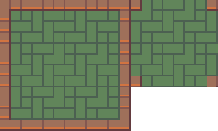

First, you have the **outer corner tiles (1) and inner corner tiles (2)**. These tiles are not repeatable, but act as crucial “end-points” to tiles in
the layout that are. The inner corner tiles are also easily missed or forgotten about when building maps, so please take care to look over your map and
make sure there are no missing spots where inner corners are needed.

Second, are the **middle edge tiles**, which are only repeatable on a horizontal or vertical plane. The left and right edge tiles can repeat when placed
vertically to itself, while the top and bottom edge tiles can only be repeated horizontally.

Lastly, you have the **center tile**. This tile will have a continuous, repeatable pattern when placed on any tile above, below, or beside itself.

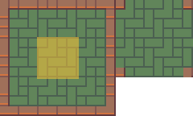

When used together, these tiles can create a variety of shapes that suit your needs. The inner corners have been highlighted in the example below to show
where you would typically use them.

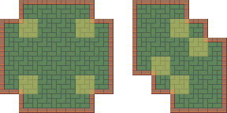

You will also find that many (but not all) decorative tiles that are 3 tiles wide or 3 tiles tall will be extendable via the middle tile(s). Feel free to
experiment with different lengths of these tiles as needed for your map.

### Trees

Trees that are bunched in groups of seven like below are also repeatable with a few steps:

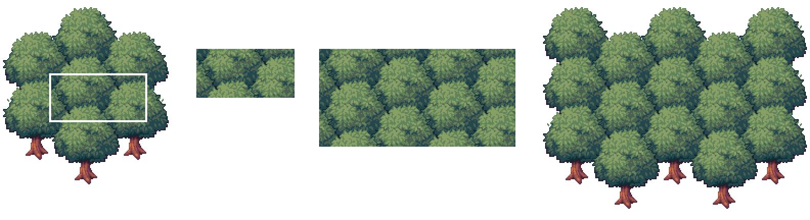

1. Start by taking a section of the middle like this 2x4 area, so that it repeats cleanly if placed above, below, or beside itself.
2. Then, tile the section as much as you need, without overlapping.
3. Once the section is your desired size, then fill in the edges utilizing the outer tiles of the bunched trees.

## Wall Tiles

Wall tiles in TwilioQuest require following a few guidelines to maintain a consistent look. First, it’s important to get acquainted with the different
wall tile types in order to use them appropriately. A typical set of wall tiles in the tileset will have this layout:

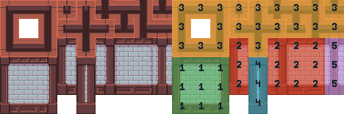

These tiles have been broken down into 5 different uses, sorted by colour.

**Green (1)**: These tiles are the **main wall tiles** you will be using to create your rooms. Like the ground tiles shown in the previous section titled
“Repeating Tiles”, these walls are made into a 3x3 layout with a mix of corner, middle edge, and center tiles.

**Red (2)**: These tiles are similar to the green tiles, however they have one key difference: they have **shadows along the sides to be placed as inner
corner walls**. Here are two examples of where they would be used:

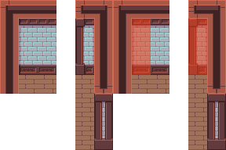

**Yellow (3)**: These are the “**top wall**” tiles. These tiles are to be placed above any of the green, red, blue or purple tiles. Some variations of
these tiles are helpful for indicating where multiple walls may intersect.

**Blue (4)**: The **single-column blue tile is used wherever a vertical wall ends**. If you are creating a gap in the vertical wall for the player to pass
through, it is important to remember to leave enough room to place these blue column tiles. Here is an example below of correct usage:

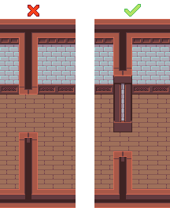

**Purple (5)**: The purple tiles are to indicate any extra tiles you might find placed with the wall tiles. Some wall tiles, like in this grouping, have
columns to help add some additional detailing to the walls. Other common wall tiles you might find are cracked bricks, windows, etc.

### Common Guidelines to Follow

- In TwilioQuest, **we maintain a consistent wall height of 3 tiles and 1 top wall, which equals 4 tiles overall**. There may be some exceptions to this
  rule of height, but in most cases having 3 vertical tiles and 1 top wall will help maintain the look of TwilioQuest, and will be the best height to
  work alongside other tiles.
- Remember to **always place and leave room for the 3 tile-high walls below the top wall tiles**. This includes any nooks and crannies in the layout, and
  the outer exterior of the room as well. Please refer to the example below:

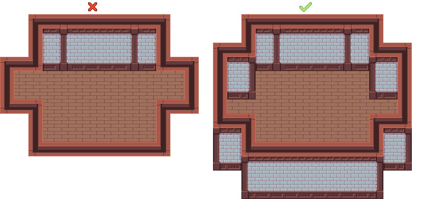

## Doorways

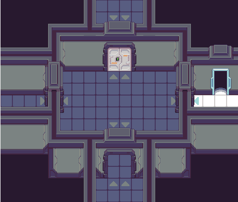

Doorways in TwilioQuest are made up of a few key components to help the player identify them on the map.These different components are colour-coded in
the example below.

**Red (1)**: There are a variety of door styles to choose from with both opening and closing animations. Some are single-tile wide while others are two
tiles wide. If you would like to flip one of the door assets to create double doors, please note that you must manually flip them as we currently do not
support Tiled’s flip function in TwilioQuest. The doors in the example above also have “locked” and “unlocked” displays if you choose to tie them into
your gameplay.

**Green (2)**: Each door is accompanied by a surrounding door frame. They help to break up the space between the door and the walls, and the left/right
facing door frames act as visual cues for side doors you cannot see in this perspective. The side door frames can be layered over the player character
to give the illusion that they are passing through them.

**Blue (3)**: These arch tiles are meant to be placed on any wall over a door. Like the side door frames, they are key visual cues for doorways that
might not be as apparent on the side or bottom of walls. There are different coloured versions of these arch tiles to work with different wall types. It
is important that these arch tiles match with the colour on top of the walls, and not with the doors or door frame.

**Purple (4)**: In cases where a north-facing doorway transports the player to an entirely separate map, you can use these fading tiles in place of or
behind a doorway. It is important to make sure that these tiles are placed on a lower layer even when there is a door, since they will be visible when
the door opening animation occurs.

**Yellow (5)**: These floor arrows are an optional accessory and can act as an additional visual cue for a doorway entrance to the player, if you choose
to use them.

## Shadows

The majority of decorative assets in the TwilioQuest tilesets have shadows already built into their sprites. These shadows are usually made using the
darkest colour in the palette at a lower opacity so that it is semi-transparent and can be placed on almost any surface. However, there are a couple of
occasions where you will have to manually place shadows from the tileset.

In the top left corner of `TwilioQuestTileset.png`, you will find a tile with semi-transparent pixels along the left side like this:

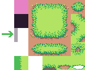

This tile is meant to be used along the left-hand side of interior floors like so:

Another instance of manual shadow placement is the darkened grass tiles, like below:

These tiles can be used on grass tiles underneath platforms and bridges (like the ones in The Forest of Open Source), around the bottom of cliff sides,
underneath the docked Fog Owl, and in heavily-forested areas like in this example image:

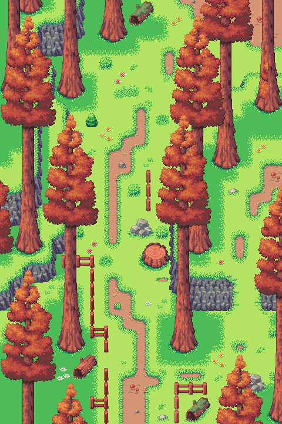

## Think Outside of the “Box”!

One of the ways we try to create player immersion is by how we consider building map layouts. While basic square and rectangular map layouts have their
place and purpose, we suggest experimenting with different layout shapes for your maps as much as possible. Here are a few of the ways you can consider
laying out your map:

The **“L” shaped layout** is an easy way to break up the box and create a sense of discovery around the corner for the player. The pool of lava is also a
great way to further break up the harsh right-angle corner of this layout.

The **top right layout** is a common layout tactic used by level designers when bringing the player to a room or place of importance. In this type of
layout, we want the player to realize that whatever is in this chest must be worth getting! There are two design choices in this room layout that help
achieve this:

1. By starting the player in a narrow corridor when they enter the room, and then having the room open itself as a larger area for a “wow” factor.
2. By creating symmetry with the room’s layout, and placing the object of importance in the center.

The **bottom layout** is a great way to break up the path of getting from exits A to B both by making the path itself an interesting shape and by
creating a branching area to explore along the way. The branching area can be used to provide additional content in the room, like a chest, npc, or
hacking spot. Branching paths should be used as a way to reward the player for exploring!

When we do use rectangular layouts (often, but not always in the context of human-made structures), we can also use art assets in a way to break up the
room that looks visually appealing and natural, and also gives variation in the way the player gets from point A to point B. Here are several different
ways you can change up the same rectangular layout shape:

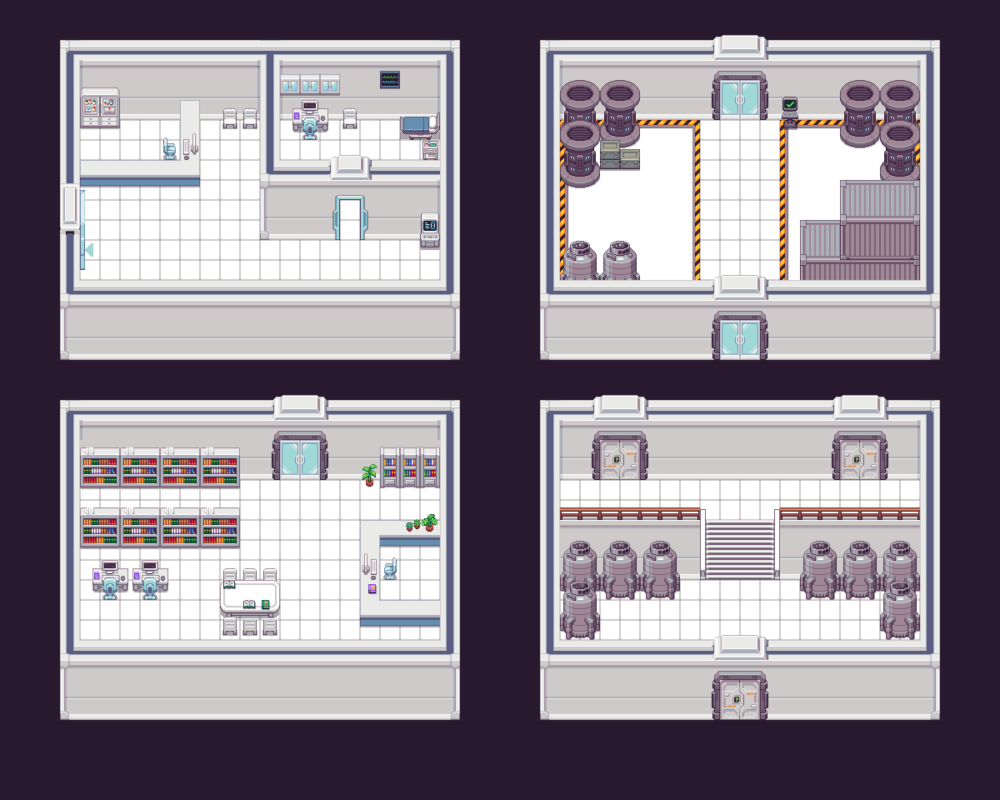

You can add flair to a simple room shape by playing with height, door placement, and adding additional walls or items like counters and crates to block
off areas.

In outdoor spaces, we can also give the illusion that the world doesn’t end at the borders of the map by using art assets like trees, cliffs, and water
that appear to extend beyond the map’s edges. The map below is also a rectangular layout, but by using these assets so that they look like they extend
outside the map helps give the impression of a larger, non-rectangular space.

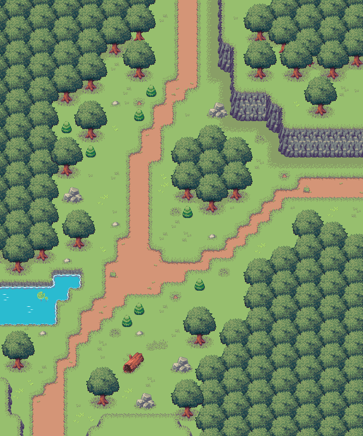

It is also important to consider the setting when creating a unique map layout. Many winding hallways with many branching paths may not make much sense
for a residential house layout, but may be an appropriate layout for a space station or cave! Consider this: If you inserted the real you into this map,
would you think that the layout makes sense to what the location is? Your room layouts should match the intended use of the space from both a design and
functionality standpoint. You can read more in-depth about this concept in the following section titled “Design vs. Functionality”.

## Design vs. Functionality

What is design vs. functionality? It is the balance between the functionality of your map’s gameplay objectives and layout, while also aiming to create
an aesthetically pleasing environment that immerses the player into the game’s world. It is important to **consider both gameplay and visuals when
creating your maps**, so that you are not left with a beautiful layout but poor gameplay design choices that confuse the player or provide them a lack of
challenge. The alternative is just as bad: an intriguing level layout and objectives that are paired with uninteresting or non immersive decorative
choices. Essentially: you should aim for your gameplay and visual choices to compliment each other in every aspect of your level design.

Some questions to ask yourself as you build your maps:

- Are your maps an appropriate size? If you are struggling to fill the space with decoration, or are playing too much “Tetris” trying to fit everything
  you want to into a map, consider changing its size!
- Are your objectives close enough together to prevent long stretches of the player walking?
- Does the overall layout seem appropriate to the environment you are trying to represent? If not, is there an explanation within the world’s story/lore?
- Does each section of your map have a cohesive look? Is there a colour scheme? Are the decorations appropriate to the space–ie. Why does the library have
  a medicine cabinet in it?
- Do the visuals and layout help draw the player’s attention to the next objective?
- Do longer layouts with many rooms/sections loop back or create shortcuts to important areas?
- Is your layout frustrating or confusing to navigate? To avoid this, make sure your connecting maps have distinct and recognizable layouts from one
  another. You can also use “**signposting**” which means adding memorable landmarks to your maps to help the player get their bearings. This can be
  anything from an important npc, a resting area like a little garden or park bench, a statue, etc.

Congrats, you’ve made it to the end! You’ve learned most of the basics to get you acquainted with using our tileset and creating maps for TwilioQuest. If
you have any questions or would like to see something covered in this guide, please feel free to reach out to the team in the TwilioQuest [Discord](https://discord.com/invite/zA9RXvm).

We can’t wait to see what you build!
