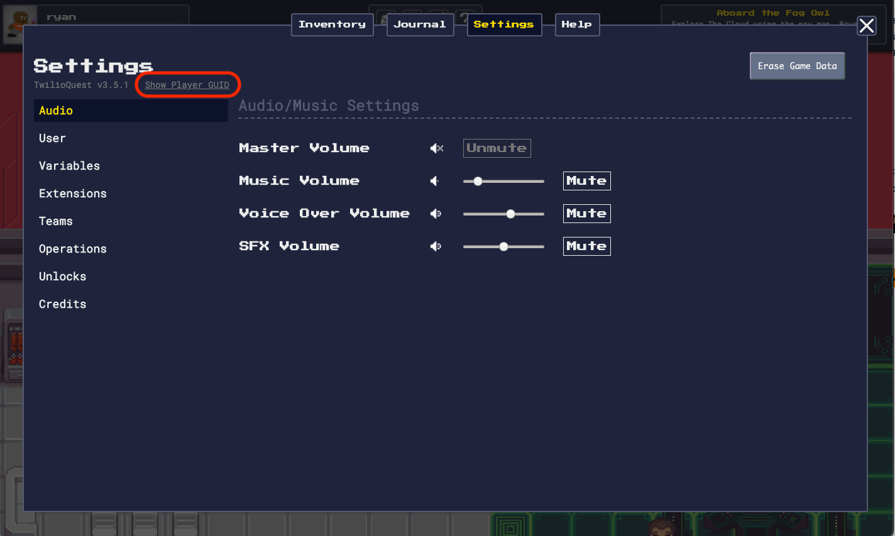

# Find your Unique Player Identifier (GUID)

Every player of TwilioQuest has a [Globally Unique Identifier (GUID)](http://guid.one/guid). We use this identifier to show your accomplishments on leaderboards, improve the game, and more. The TwilioQuest team might ask you for this GUID to debug server-related features of TwilioQuest. This guide will show you how to find your GUID.

:::warning

Your player GUID is not linked to any email or personal identifying information (beyond your TwilioQuest username). However, a malicious user could send us fake data about your accomplishments if they get your GUID. **For this reason, you should keep your GUID to yourself!** (Unless a Twilio employee specifically asks you for it).

:::

## Finding your Player GUID

To find your player GUID, you should first open the settings menu. You can find the link to open it in the top menu bar of TwilioQuest. You can also open it by pressing the number `3` on your keyboard.

Once you have the Settings menu opened, you should see a link that reads "Show Player GUID" in the top left. Clicking this link will reveal your player GUID in the same space. Clicking again will hide it.

:::warning

Be sure to keep your GUID to yourself, unless a Twilio employee asks for it!

:::

